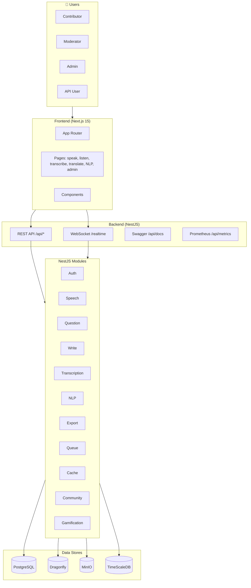
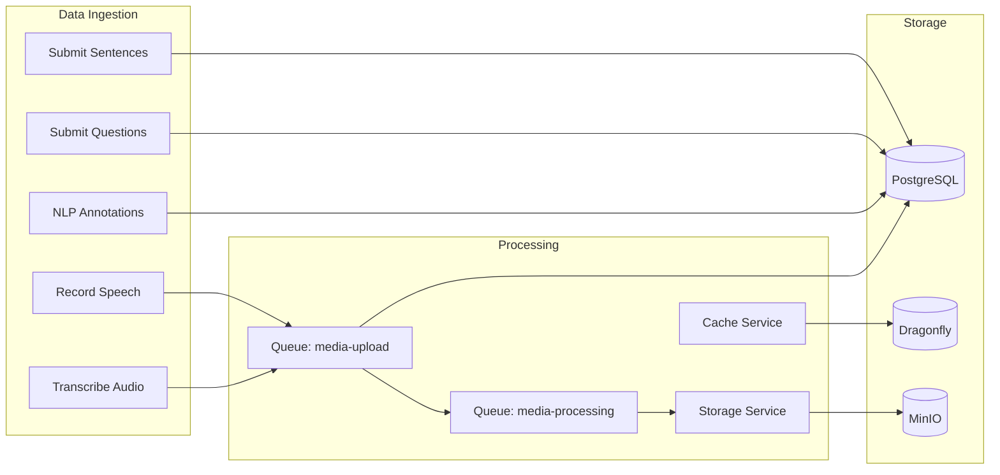
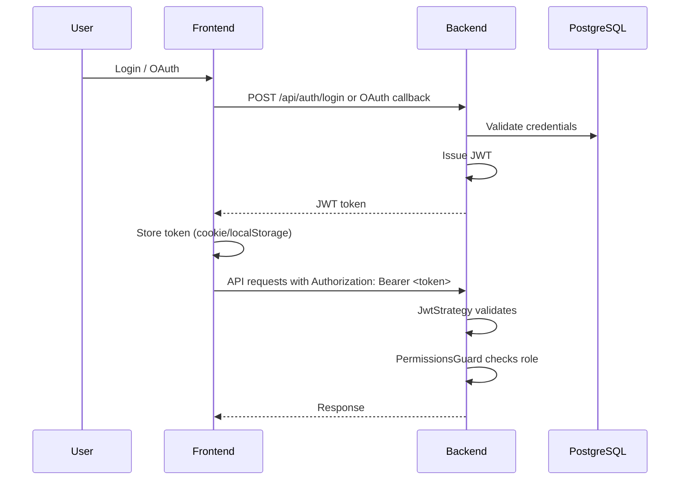
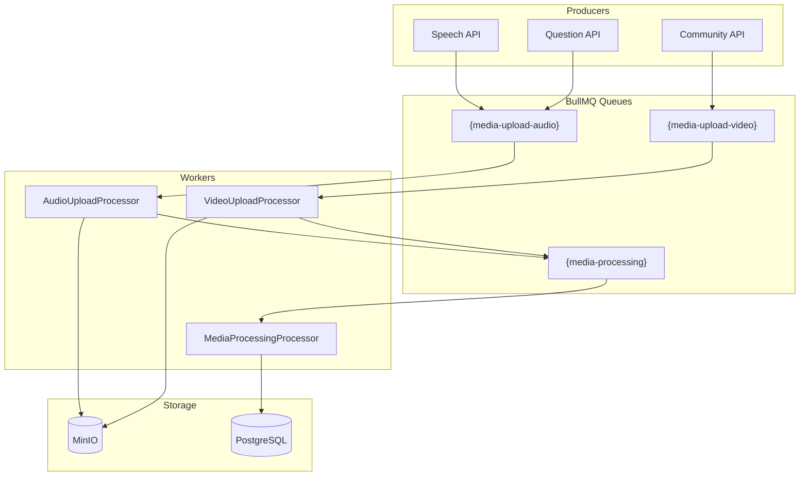
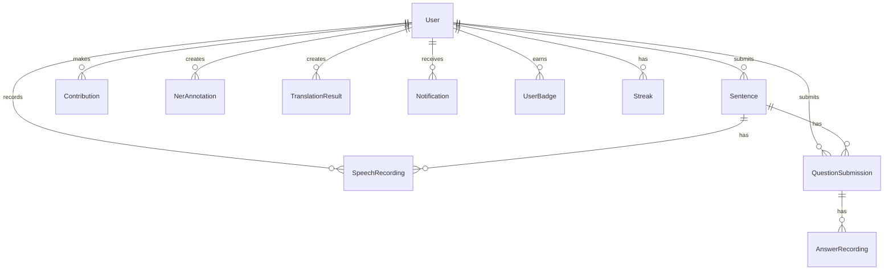

# Voice Data Collection Platform — Architecture

**Document Version:** 1.0  
**Last Updated:** February 16, 2026

---

## Executive Summary

The Voice Data Collection Platform is a **crowdsourcing web application** for collecting and processing linguistic voice data across 23+ Indian languages. Contributors record speech, transcribe audio, translate text, and perform NLP annotations. The system uses a modern microservices-oriented stack with NestJS, Next.js, PostgreSQL/YugaByteDB, Dragonfly (Redis-compatible cache/queue), MinIO, and optional analytics stores.

---

## 1. High-Level System Architecture

```
┌──────────────────────────────────────────────────────────────────────────────────────────────────┐
│                                    EXTERNAL USERS                                                │
│  Contributors │ Moderators │ Admins │ Researchers (API)                                          │
└──────────────────────────────────────────────────────────────────────────────────────────────────┘
                                          │
                                          ▼
┌──────────────────────────────────────────────────────────────────────────────────────────────────┐
│                              PRESENTATION LAYER                                                  │
│  ┌───────────────────────────────────────────────────────────────────────────────────────────┐   │
│  │  Next.js 15 Frontend (React 19)                                                           │   │
│  │  • App Router • Tailwind CSS • i18n (LangSwitcher) • Server & Client Components           │   │
│  │  Port: 5577                                                                               │   │
│  └───────────────────────────────────────────────────────────────────────────────────────────┘   │
└──────────────────────────────────────────────────────────────────────────────────────────────────┘
                                          │
                              REST API + WebSocket (Socket.IO)
                                          │
                                          ▼
┌───────────────────────────────────────────────────────────────────────────────────────────────────┐
│                              APPLICATION LAYER                                                    │
│  ┌────────────────────────────────────────────────────────────────────────────────────────────┐   │
│  │  NestJS Backend API                                                                        │   │
│  │  • REST /api/* • Swagger /api/docs • JWT + OAuth (Google, GitHub) • API Keys               │   │
│  │  • Throttling • Validation • Exception Filters • Prometheus /api/metrics/prometheus        │   │
│  │  Port: 5566 (mapped from 3001)                                                             │   │
│  └────────────────────────────────────────────────────────────────────────────────────────────┘   │
└───────────────────────────────────────────────────────────────────────────────────────────────────┘
                                          │
                                          ▼
┌───────────────────────────────────────────────────────────────────────────────────────────────────┐
│                              CORE SERVICES (NestJS Modules)                                       │
│  ┌─────────────┐ ┌─────────────┐ ┌─────────────┐ ┌─────────────┐ ┌──────────────┐ ┌─────────────┐ │
│  │ Auth        │ │ Speech      │ │ Question    │ │ Write       │ │ Transcription│ │ NLP         │ │
│  │ Users       │ │ Storage     │ │ Progress    │ │ Dataset     │ │ Scheduler    │ │ Search      │ │
│  └─────────────┘ └─────────────┘ └─────────────┘ └─────────────┘ └──────────────┘ └─────────────┘ │
│  ┌─────────────┐ ┌─────────────┐ ┌─────────────┐ ┌──────────────┐ ┌─────────────┐ ┌─────────────┐ │
│  │ Admin       │ │ Analytics   │ │ Metrics     │ │ Notifications│ │ Realtime    │ │ Gamification│ │
│  │ Export      │ │ Quality     │ │ Community   │ │ Queue        │ │ Cache       │ │ Languages   │ │
│  └─────────────┘ └─────────────┘ └─────────────┘ └──────────────┘ └─────────────┘ └─────────────┘ │
└───────────────────────────────────────────────────────────────────────────────────────────────────┘
                                          │
                                          ▼
┌────────────────────────────────────────────────────────────────────────────────────────────────────┐
│                              DATA & INFRASTRUCTURE LAYER                                           │
│  ┌──────────────┐ ┌──────────────┐ ┌──────────────┐ ┌──────────────┐ ┌──────────────┐              │
│  │ PostgreSQL   │ │ Dragonfly    │ │ MinIO        │ │ TimeScaleDB  │ │ Backup       │              │
│  │ (Primary DB) │ │ (Cache/Queue)│ │ (Blob Store) │ │ (Time-series)│ │ (pg_dump)    │              │
│  │ Port: 5432   │ │ Port: 6378   │ │ Port: 9002   │ │ Port: 5434   │ │ Profile      │              │
│  └──────────────┘ └──────────────┘ └──────────────┘ └──────────────┘ └──────────────┘              │
│  ┌──────────────┐ ┌──────────────┐ ┌──────────────┐                                                │
│  │ Prometheus   │ │ Grafana      │ │ Qdrant/Neo4j │  (Optional: vector/graph storage)              │
│  │ Port: 9090   │ │ Port: 3001   │ │ Port: 6333   │                                                │
│  └──────────────┘ └──────────────┘ └──────────────┘                                                │
└────────────────────────────────────────────────────────────────────────────────────────────────────┘
```

---

## 2. Detailed Architecture Diagram (Mermaid)



---

## 3. Data Flow Architecture



---

## 4. Component Breakdown

### 4.1 Frontend (Next.js 15)

```
┌─────────────────────────────────────────────────────────────────────────────────────────────────────────┐
| Area           | Path                                     | Description                                 |
| -------------- | ---------------------------------------- | ------------------------------------------- |
| **App Router** | `frontend/app/`                          | Pages and layouts                           |
| **Components** | `frontend/components/`                   | Reusable UI (LangSwitcher, RecordBtn, etc.) |
| **Lib**        | `frontend/lib/`                          | Hooks, utilities, API client                |
| **Key Pages**  |                                          |                                             |
| Home/Dashboard | `/`                                      | Landing                                     |
| Speech         | `/speak`, `/listen`, `/speech/*`         | Record, validate, list audio                |
| Transcription  | `/transcribe`, `/transcription/*`        | Submit and review transcriptions            |
| Translation    | `/translate`, `/translate-review`        | Translation tasks                           |
| NLP            | `/ner`, `/pos`, `/sentiment`, `/emotion` | NLP annotation tasks                        |
| Questions      | `/question/*`                            | Q&A crowdsourcing                           |
| Write          | `/write`                                 | Sentence submission                         |
| Admin          | `/admin/*`                               | Dashboard, users, moderation, analytics     |
| Auth           | `/login`, `/auth/*`                      | Login, OAuth callback, password reset       |
| Docs           | `/docs/*`                                | API documentation                           |
└─────────────────────────────────────────────────────────────────────────────────────────────────────────┘
```

**Tech Stack:** React 19, Tailwind CSS, Next.js App Router, i18n support.

---

### 4.2 Backend (NestJS)

```
┌─────────────────────────────────────────────────────────────────────────────────┐
| Module                  | Responsibility                                        |
| ----------------------- | ----------------------------------------------------- |
| **AuthModule**          | JWT, OAuth (Google, GitHub), API keys, password reset |
| **UsersModule**         | User profiles, verification, preferences              |
| **SpeechModule**        | Speech recording CRUD, validation, MinIO upload       |
| **QuestionModule**      | Question submissions, answer recordings               |
| **WriteModule**         | Sentence submissions                                  |
| **TranscriptionModule** | Transcription submit/review                           |
| **NlpModule**           | NER, POS, translation, sentiment, emotion             |
| **StorageModule**       | MinIO S3-compatible blob storage                      |
| **CacheModule**         | L1 in-memory + L2 Dragonfly, cache warming            |
| **QueueModule**         | BullMQ (media-upload-audio/video, media-processing)   |
| **ProgressModule**      | User progress tracking                                |
| **DatasetModule**       | Dataset management                                    |
| **AnalyticsModule**     | Statistics and analytics                              |
| **MetricsModule**       | Prometheus metrics                                    |
| **AdminModule**         | Admin operations, moderation                          |
| **ExportModule**        | Data export (CSV, etc.)                               |
| **QualityModule**       | IAA, anomaly detection                                |
| **CommunityModule**     | Blog, forum, FAQ, feedback                            |
| **GamificationModule**  | Badges, streaks, leaderboard                          |
| **NotificationsModule** | Email, push, in-app                                   |
| **RealtimeModule**      | WebSocket (Socket.IO) gateway                         |
| **SearchModule**        | Search functionality                                  |
| **LanguagesModule**     | Language list API (cached)                            |
| **SchedulerModule**     | Cron/scheduled jobs                                   |
└─────────────────────────────────────────────────────────────────────────────────┘
```

---

### 4.3 Data Stores

```
┌─────────────────────────────────────────────────────────────────────────────────────────────────────────────┐
| Store           | Purpose                                                      | Port                       |
| --------------- | ------------------------------------------------------------ | -------------------------- |
| **PostgreSQL**  | Primary relational data (users, sentences, recordings, etc.) | 5432                       |
| **YugaByteDB**  | Alternative PostgreSQL-compatible DB                         | 5433                       |
| **Dragonfly**   | Redis-compatible cache + BullMQ job queue                    | 6378                       |
| **MinIO**       | S3-compatible blob storage (audio, video, exports)           | 9002 (API), 9001 (Console) |
| **TimeScaleDB** | Time-series analytics                                        | 5434                       |
| **Qdrant**      | Vector storage (optional)                                    | 6333                       |
| **Neo4j**       | Graph storage (optional)                                     | 7474, 7687                 |
└─────────────────────────────────────────────────────────────────────────────────────────────────────────────┘
```

---

### 4.4 Monitoring & Observability

```
┌───────────────────────────────────────────────────────────────────────────┐
| Component           | Purpose                                             |
| ------------------- | --------------------------------------------------- |
| **Prometheus**      | Scrapes `/api/metrics/prometheus` from backend      |
| **Grafana**         | Dashboards, provisioned via `grafana/provisioning/` |
| **Backend Metrics** | Custom counters, histograms, gauges                 |
└───────────────────────────────────────────────────────────────────────────┘
```
---

## 5. Authentication & Authorization Flow



**Roles:** `USER`, `MODERATOR`, `ADMIN`, `SUPER_ADMIN`

---

## 6. Queue Architecture (BullMQ + Dragonfly)



**Note:** Hashtags `{name}` in queue names enable Dragonfly cluster-mode compatibility.

---

## 7. Cache Architecture

```
┌────────────────────────────────────────────────────────────────────────┐
| Layer           | Technology            | Use Case                     |
| --------------- | --------------------- | ---------------------------- |
| **L1**          | In-memory (Node.js)   | Hot data, TTL + max size     |
| **L2**          | Dragonfly (Redis)     | Shared cache, session, queue |
| **Warming**     | Cache warming service | Pre-populate languages, etc. |
| **Compression** | Gzip                  | Values > 1KB                 |
└────────────────────────────────────────────────────────────────────────┘
```
---

## 8. Database Schema (Core Entities)



**Key Models:** `User`, `Sentence`, `SpeechRecording`, `Validation`, `QuestionSubmission`, `AnswerRecording`, `TranslationMapping`, `NerAnnotation`, `Contribution`, `Notification`, `UserBadge`, `Streak`, `AudioMetadata`, `TranscriptionReview`, etc.

---

## 9. Deployment Topology (Docker Compose)

```
┌──────────────────────────────────────────────────────────────────────────────┐
│                         Docker Compose Stack                                 │
├──────────────────────────────────────────────────────────────────────────────┤
│  postgres      │ Primary database                                            │
│  dragonfly     │ Cache + BullMQ                                              │
│  minio         │ Blob storage                                                │
│  timescaledb   │ Time-series                                                 │
│  qdrant        │ Vector (optional)                                           │
│  neo4j         │ Graph (optional)                                            │
│  prometheus    │ Metrics                                                     │
│  grafana       │ Dashboards                                                  │
│  backend       │ NestJS API (depends: postgres, dragonfly, minio, timescale) │
│  frontend      │ Next.js (depends: backend)                                  │
│  backup        │ pg_dump daily (profile: backup)                             │
└──────────────────────────────────────────────────────────────────────────────┘
```

---

## 10. Security Overview

```
┌──────────────────────────────────────────────────────────────────────────────────────┐
| Layer              | Mechanism                                                       |
| ------------------ | --------------------------------------------------------------- |
| **Authentication** | JWT (24h), OAuth (Google, GitHub), API keys                     |
| **Authorization**  | Role-based (USER/MODERATOR/ADMIN/SUPER_ADMIN), PermissionsGuard |
| **Rate Limiting**  | ThrottlerModule (60/min, 10/sec short)                          |
| **Validation**     | class-validator DTOs, ValidationPipe                            |
| **CORS**           | Configured for frontend origin                                  |
| **Secrets**        | JWT_SECRET, OAuth credentials, SMTP, DB URLs via env            |
└──────────────────────────────────────────────────────────────────────────────────────┘
```

---

## 11. Scalability Considerations

- **Queue:** BullMQ + Dragonfly for async media processing
- **Cache:** L1 + L2 for read-heavy endpoints (e.g. languages)
- **Database:** Connection pooling, read replicas, partitioning (see REMAINING_FEATURES.md)
- **Storage:** MinIO distributed mode or S3 at scale
- **Target:** 7,100+ languages, ~710K–7.1M daily uploads (see REMAINING_FEATURES.md)

---

## 12. Related Documentation

- `README.md` — Quick start, services, development
- `REMAINING_FEATURES.md` — Feature gaps, scale requirements, and queue/storage/DB considerations
- `backend/README.md` — Backend API details
- `frontend/README.md` — Frontend setup

---

_Built for linguistic diversity and AI research._
