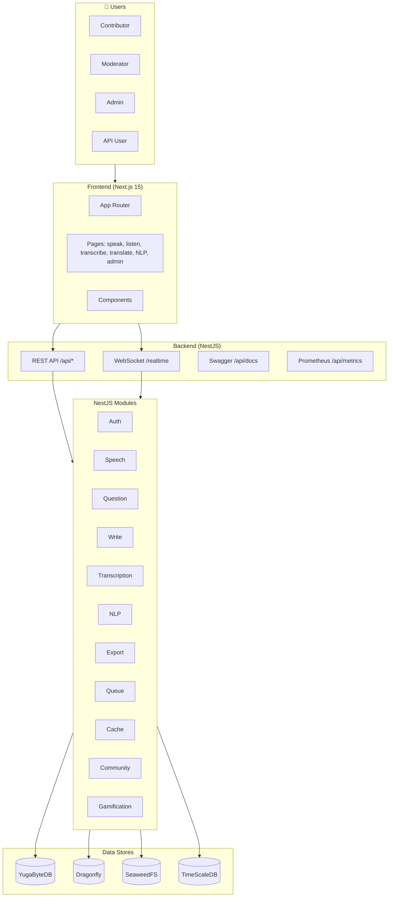
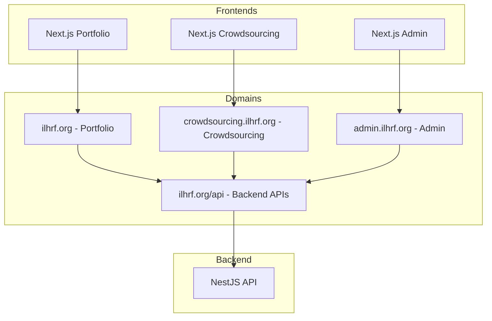
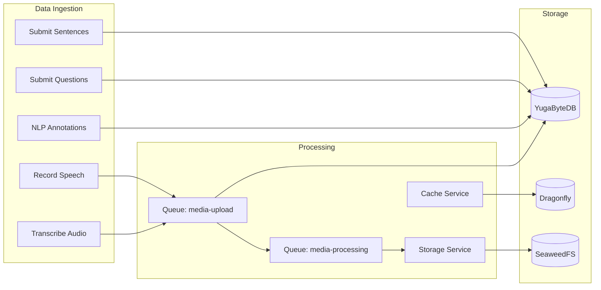
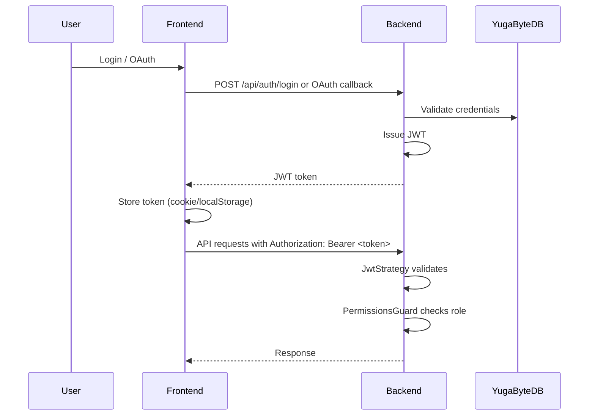
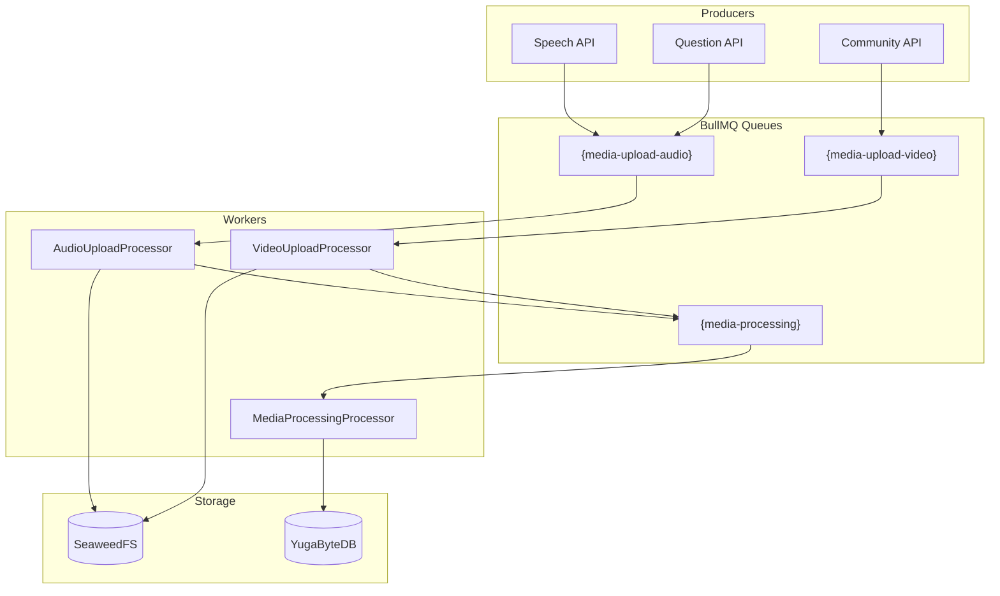
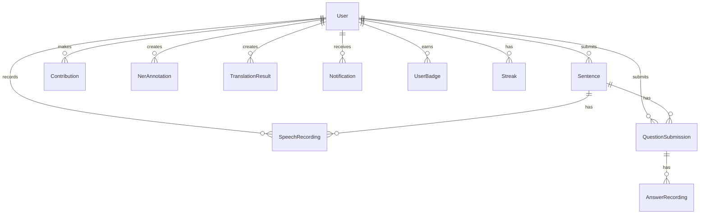

# ILHRF Data Collection Platform — Architecture

**Document Version:** 1.3

**Last Updated:** February 20, 2026

---

## Executive Summary

The ILHRF Data Collection Platform is a **crowdsourcing web application** for collecting and processing linguistic voice data across **7,100+ languages globally**. Contributors record speech, transcribe audio, translate text, and perform NLP annotations. The system uses a modern microservices-oriented stack with NestJS, Next.js, YugaByteDB (default, PostgreSQL-compatible), Dragonfly (Redis-compatible cache/queue), SeaweedFS, and optional analytics stores. The platform is split into three frontends: Portfolio (ilhrf.org), Crowdsourcing (crowdsourcing.ilhrf.org), and Admin (admin.ilhrf.org), all sharing a single backend API at ilhrf.org/api.

---

## 1. High-Level System Architecture

```
┌───────────────────────────────────────────────────────────────────────────────────────────────────────┐
│                                    EXTERNAL USERS                                                     │
│  Contributors │ Moderators │ Admins │ Researchers (API)                                               │
└───────────────────────────────────────────────────────────────────────────────────────────────────────┘
                                          │
                                    HTTPS/HTTP2 (optional)
                                          │
                                          ▼
┌───────────────────────────────────────────────────────────────────────────────────────────────────────┐
│  Nginx Reverse Proxy (optional, profile http2) — TLS termination, HTTP/2, proxies to backend/frontend │
└───────────────────────────────────────────────────────────────────────────────────────────────────────┘
                                          │
                                          ▼
┌───────────────────────────────────────────────────────────────────────────────────────────────────────┐
│                              PRESENTATION LAYER                                                       │
│  ┌────────────────────────────────────────────────────────────────────────────────────────────────┐   │
│  │  Next.js 15 Frontend (React 19)                                                                │   │
│  │  • App Router • Tailwind CSS • i18n (LangSwitcher) • Server & Client Components                │   │
│  │  Port: 5577                                                                                    │   │
│  └────────────────────────────────────────────────────────────────────────────────────────────────┘   │
└───────────────────────────────────────────────────────────────────────────────────────────────────────┘
                                          │
                              REST API + WebSocket (Socket.IO)
                                          │
                                          ▼
┌───────────────────────────────────────────────────────────────────────────────────────────────────────┐
│                              APPLICATION LAYER                                                        │
│  ┌────────────────────────────────────────────────────────────────────────────────────────────────┐   │
│  │  NestJS Backend API                                                                            │   │
│  │  • REST /api/* • Swagger /api/docs • JWT + OAuth (Google, GitHub) • API Keys                   │   │
│  │  • Throttling • Validation • Exception Filters • Prometheus /api/metrics/prometheus.           │   │
│  │  Port: 5566 (mapped from 3001)                                                                 │   │
│  └────────────────────────────────────────────────────────────────────────────────────────────────┘   │
└───────────────────────────────────────────────────────────────────────────────────────────────────────┘
                                          │
                                          ▼
┌───────────────────────────────────────────────────────────────────────────────────────────────────────┐
│                              CORE SERVICES (NestJS Modules)                                           │
│  ┌─────────────┐ ┌─────────────┐ ┌─────────────┐ ┌─────────────┐ ┌──────────────┐ ┌─────────────┐     │
│  │ Auth        │ │ Speech      │ │ Question    │ │ Write       │ │ Transcription│ │ NLP         │     │
│  │ Users       │ │ Storage     │ │ Progress    │ │ Dataset     │ │ Scheduler    │ │ Search      │     │
│  └─────────────┘ └─────────────┘ └─────────────┘ └─────────────┘ └──────────────┘ └─────────────┘     │
│  ┌─────────────┐ ┌─────────────┐ ┌─────────────┐ ┌──────────────┐ ┌─────────────┐ ┌─────────────┐     │
│  │ Admin       │ │ Analytics   │ │ Metrics     │ │ Notifications│ │ Realtime    │ │ Gamification│     │
│  │ Export      │ │ Quality     │ │ Community   │ │ Queue        │ │ Cache       │ │ Languages   │     │
│  └─────────────┘ └─────────────┘ └─────────────┘ └──────────────┘ └─────────────┘ └─────────────┘     │
└───────────────────────────────────────────────────────────────────────────────────────────────────────┘
                                          │
                                          ▼
┌───────────────────────────────────────────────────────────────────────────────────────────────────────┐
│                              DATA & INFRASTRUCTURE LAYER                                              │
│  ┌──────────────┐ ┌──────────────┐ ┌──────────────┐ ┌──────────────┐ ┌──────────────┐                 │
│  │ YugaByteDB   │ │ Dragonfly    │ │ SeaweedFS    │ │ TimeScaleDB  │ │ Backup       │                 │
│  │ (Primary DB) │ │ (Cache/Queue)│ │ (Blob Store) │ │ (Time-series)│ │ (pg_dump)    │                 │
│  │ Port: 5433   │ │ Port: 6378   │ │ Port: 8333   │ │ Port: 5434   │ │ Profile      │                 │
│  └──────────────┘ └──────────────┘ └──────────────┘ └──────────────┘ └──────────────┘                 │
│  ┌──────────────┐ ┌──────────────┐                                                                    │
│  │ Prometheus   │ │ Grafana      │                                                                    │
│  │ Port: 9090   │ │ Port: 3001   │                                                                    │
│  └──────────────┘ └──────────────┘                                                                    │
└───────────────────────────────────────────────────────────────────────────────────────────────────────┘
```

---

## 2. Detailed Architecture Diagram



---

## 2.5 Multi-Domain Architecture

The platform is split into three frontend applications, each deployed on its own subdomain:



| Domain | App | Purpose |
|--------|-----|---------|
| **ilhrf.org** | `frontend-portfolio` | Public website: home, about, contact, terms, privacy |
| **crowdsourcing.ilhrf.org** | `frontend` | Crowdsourcing tasks: speak, listen, write, translate, NLP |
| **admin.ilhrf.org** | `frontend-admin` | Admin dashboard, users, moderation, analytics |
| **ilhrf.org/api** | `backend` | REST API and Socket.IO (shared by all frontends) |

### Environment Variables by Frontend

| Frontend | Env Var | Purpose |
|----------|---------|---------|
| **Portfolio** | `NEXT_PUBLIC_FRONTEND_URL` | Base URL for portfolio (e.g. https://ilhrf.org) |
| **Portfolio** | `NEXT_PUBLIC_CROWDSOURCING_URL` | Link to crowdsourcing app (e.g. https://crowdsourcing.ilhrf.org) |
| **Crowdsourcing** | `NEXT_PUBLIC_FRONTEND_URL` | Base URL for crowdsourcing app |
| **Crowdsourcing** | `NEXT_PUBLIC_API_URL` | Backend API URL (e.g. https://ilhrf.org/api) |
| **Crowdsourcing** | `NEXT_PUBLIC_PORTFOLIO_URL` | Link to portfolio (e.g. https://ilhrf.org) |
| **Admin** | `NEXT_PUBLIC_FRONTEND_URL` | Base URL for admin app |
| **Admin** | `NEXT_PUBLIC_API_URL` | Backend API URL |
| **Backend** | `CORS_ORIGIN` | Comma-separated allowed origins |
| **Backend** | `FRONTEND_URL` | Comma-separated origins for Socket.IO CORS (crowdsourcing + admin) |

---

## 3. Data Flow Architecture



---

## 4. Component Breakdown

### 4.1 Frontend (Next.js 15)

```
┌─────────────────────────────────────────────────────────────────────────────────────────────────────────┐
| Area           | Path                                     | Description                                 |
| -------------- | ---------------------------------------- | ------------------------------------------- |
| **App Router** | `frontend/app/`                          | Pages and layouts                           |
| **Components** | `frontend/components/`                   | Reusable UI (LangSwitcher, RecordBtn, etc.) |
| **Lib**        | `frontend/lib/`                          | Hooks, utilities, API client                |
| **Key Pages**  |                                          |                                             |
| Home/Dashboard | `/`                                      | Landing                                     |
| Speech         | `/speak`, `/listen`, `/speech/*`         | Record, validate, list audio                |
| Transcription  | `/transcribe`, `/transcription/*`        | Submit and review transcriptions            |
| Translation    | `/translate`, `/translate-review`        | Translation tasks                           |
| NLP            | `/ner`, `/pos`, `/sentiment`, `/emotion` | NLP annotation tasks                        |
| Questions      | `/question/*`                            | Q&A crowdsourcing                           |
| Write          | `/write`                                 | Sentence submission                         |
| Auth           | `/login`, `/auth/*`                      | Login, OAuth callback, password reset       |
| Docs           | `/docs/*`                                | API documentation                           |
└─────────────────────────────────────────────────────────────────────────────────────────────────────────┘
```

**Tech Stack:** React 19, Tailwind CSS, Next.js App Router, i18n support.

**Admin** (`frontend-admin`): Separate Next.js app at admin.ilhrf.org. Routes: `/dashboard`, `/users`, `/content-moderation`, `/analytics`, `/settings`, etc. Uses `NEXT_PUBLIC_API_URL` to call backend directly.

**Portfolio** (`frontend-portfolio`): Separate Next.js app at ilhrf.org. Routes: `/`, `/about`, `/contact`, `/terms`, `/privacy`, `/cookies`, `/data-rights`. Links to crowdsourcing and admin for login/contributing.

---

### 4.2 Backend (NestJS)

```
┌─────────────────────────────────────────────────────────────────────────────────┐
| Module                  | Responsibility                                        |
| ----------------------- | ----------------------------------------------------- |
| **AuthModule**          | JWT, OAuth (Google, GitHub), API keys, password reset |
| **UsersModule**         | User profiles, verification, preferences              |
| **SpeechModule**        | Speech recording CRUD, validation, SeaweedFS upload   |
| **QuestionModule**      | Question submissions, answer recordings               |
| **WriteModule**         | Sentence submissions                                  |
| **TranscriptionModule** | Transcription submit/review                           |
| **NlpModule**           | NER, POS, translation, sentiment, emotion             |
| **StorageModule**       | SeaweedFS S3-compatible blob storage                  |
| **CacheModule**         | L1 in-memory + L2 Dragonfly, cache warming            |
| **QueueModule**         | BullMQ (media-upload-audio/video, media-processing)   |
| **ProgressModule**      | User progress tracking                                |
| **DatasetModule**       | Dataset management                                    |
| **AnalyticsModule**     | Statistics and analytics                              |
| **MetricsModule**       | Prometheus metrics                                    |
| **AdminModule**         | Admin operations, moderation                          |
| **ExportModule**        | Data export (CSV, etc.)                               |
| **QualityModule**       | IAA, anomaly detection                                |
| **CommunityModule**     | Blog, forum, FAQ, feedback                            |
| **GamificationModule**  | Badges, streaks, leaderboard                          |
| **NotificationsModule** | Email, push, in-app                                   |
| **RealtimeModule**      | WebSocket (Socket.IO) gateway                         |
| **SearchModule**        | Search functionality                                  |
| **LanguagesModule**     | Language list API (cached)                            |
| **SchedulerModule**     | Cron/scheduled jobs                                   |
└─────────────────────────────────────────────────────────────────────────────────┘
```

---

### 4.3 Data Stores

```
┌─────────────────────────────────────────────────────────────────────────────────────────────────────────────┐
| Store           | Purpose                                                      | Port                       |
| --------------- | ------------------------------------------------------------ | -------------------------- |
| **YugaByteDB**  | Primary relational data (users, sentences, recordings, etc.) | 5433                       |
| **PostgreSQL**  | Alternative (commented out in compose; uncomment to use)     | 5432                       |
| **Dragonfly**   | Redis-compatible cache + BullMQ job queue                    | 6378                       |
| **SeaweedFS**   | S3-compatible blob storage (audio, video, exports)           | 8333 (S3 API), 8888 (Filer)|
| **TimeScaleDB** | Time-series analytics                                        | 5434                       |
└─────────────────────────────────────────────────────────────────────────────────────────────────────────────┘
```

---

### 4.4 Monitoring & Observability

```
┌───────────────────────────────────────────────────────────────────────────┐
| Component           | Purpose                                             |
| ------------------- | --------------------------------------------------- |
| **Prometheus**      | Scrapes `/api/metrics/prometheus` from backend      |
| **Grafana**         | Dashboards, provisioned via `grafana/provisioning/` |
| **Backend Metrics** | Custom counters, histograms, gauges                 |
└───────────────────────────────────────────────────────────────────────────┘
```

---

## 5. Authentication & Authorization Flow



**Roles:** `USER`, `MODERATOR`, `ADMIN`, `SUPER_ADMIN`

---

## 6. Queue Architecture (BullMQ + Dragonfly)



**Note:** Hashtags `{name}` in queue names enable Dragonfly cluster-mode compatibility.

---

## 7. Cache Architecture

```
┌────────────────────────────────────────────────────────────────────────┐
| Layer           | Technology            | Use Case                     |
| --------------- | --------------------- | ---------------------------- |
| **L1**          | In-memory (Node.js)   | Hot data, TTL + max size     |
| **L2**          | Dragonfly (Redis)     | Shared cache, session, queue |
| **Warming**     | Cache warming service | Pre-populate languages, etc. |
| **Compression** | Gzip                  | Values > 1KB                 |
└────────────────────────────────────────────────────────────────────────┘
```

---

## 8. Database Schema (Core Entities)



**Key Models:** `User`, `Sentence`, `SpeechRecording`, `Validation`, `QuestionSubmission`, `AnswerRecording`, `TranslationMapping`, `NerAnnotation`, `Contribution`, `Notification`, `UserBadge`, `Streak`, `AudioMetadata`, `TranscriptionReview`, etc.

---

## 9. Deployment Topology (Docker Compose)

```
┌───────────────────────────────────────────────────────────────────────────────────┐
│                         Docker Compose Stack                                      │
├───────────────────────────────────────────────────────────────────────────────────┤
│  yugabytedb-node1/2/3 │ 3-node YugaByteDB cluster (ilhrf-yugabyte-node*); PostgreSQL commented │
│  db-init              │ Creates ilhrf_data_collection DB before backend migrations │
│  dragonfly            │ Cache + BullMQ                                                   │
│  seaweedfs-*           │ Blob storage (master, volume, filer, s3)                         │
│  timescaledb          │ Time-series                                                      │
│  prometheus           │ Metrics                                                          │
│  grafana              │ Dashboards                                                       │
│  backend              │ NestJS API (depends: db-init, yugabytedb-node1, dragonfly, seaweedfs-s3, timescaledb) │
│  frontend             │ Crowdsourcing Next.js (port 5577, depends: backend)               │
│  frontend-portfolio   │ Portfolio Next.js (port 5579)                                    │
│  frontend-admin       │ Admin Next.js (port 5578, depends: backend)                        │
│  nginx                │ HTTP/2 reverse proxy (profile: http2)                              │
│  backup               │ pg_dump daily (profile: backup, commented)                       │
└───────────────────────────────────────────────────────────────────────────────────┘
```

---

## 10. Security Overview

```
┌──────────────────────────────────────────────────────────────────────────────────────┐
| Layer              | Mechanism                                                       |
| ------------------ | --------------------------------------------------------------- |
| **Authentication** | JWT (24h), OAuth (Google, GitHub), API keys                     |
| **Authorization**  | Role-based (USER/MODERATOR/ADMIN/SUPER_ADMIN), PermissionsGuard |
| **Rate Limiting**  | ThrottlerModule (60/min, 10/sec short)                          |
| **Validation**     | class-validator DTOs, ValidationPipe                            |
| **CORS**           | Configured for frontend origin                                  |
| **Secrets**        | JWT_SECRET, OAuth credentials, SMTP, DB URLs via env            |
└──────────────────────────────────────────────────────────────────────────────────────┘
```

---

## 11. Scalability Considerations

- **Queue:** BullMQ + Dragonfly for async media processing
- **Cache:** L1 + L2 for read-heavy endpoints (e.g. languages)
- **Database:** Connection pooling, read replicas, partitioning (see REMAINING_FEATURES.md)
- **Storage:** SeaweedFS distributed mode or S3 at scale
- **Target:** 7,100+ languages, ~710K–7.1M daily uploads (see REMAINING_FEATURES.md)

---

## 12. Related Documentation

- `README.md` — Quick start, services, development
- `REMAINING_FEATURES.md` — Feature gaps, scale requirements, and queue/storage/DB considerations
- `backend/README.md` — Backend API details
- `frontend/README.md` — Frontend setup

---

_Built for linguistic diversity and AI research._
